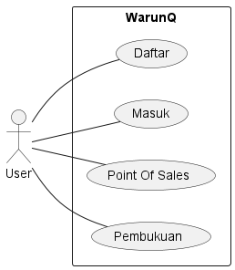

# WarunQ

***

## Scope
WarunQ adalah produk perangkat lunak generik yang muncul dari keprihatinan pengembang terhadap warung-warung kecil di Indonesia yang masih melakukan pembukuan konvensional, sehingga kami berpikir untuk menciptakan produk berupa aplikasi desktop untuk dapat melakukan pembukuan secara digital.

## Functional Requirements

- Daftar
- Masuk
- Point Of Sales
- Pembukuan

## Representation

## Limitation

